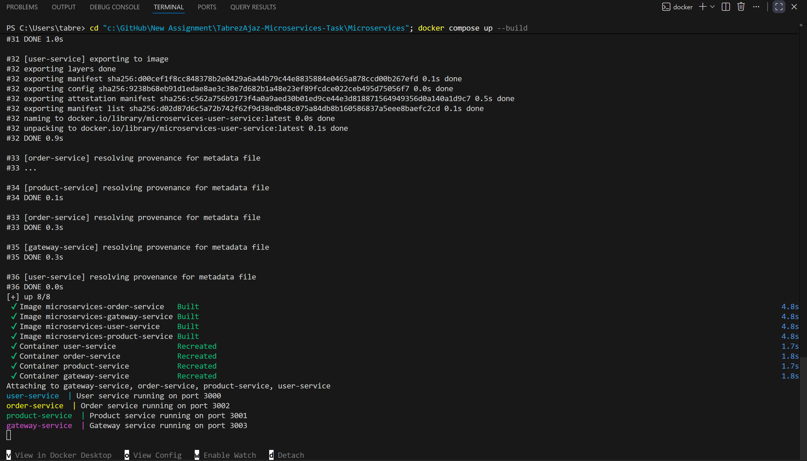
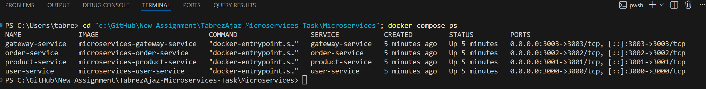
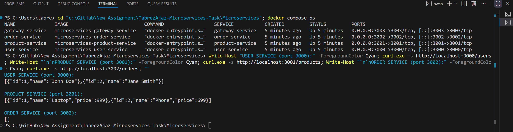
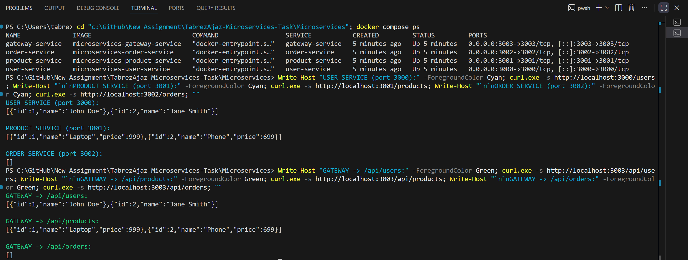

# Microservices Task — Dockerized Node.js Microservices

Containerized microservices application with **four Node.js (Express) services**
orchestrated using **Docker Compose**. The Gateway Service aggregates the other
three services and exposes them under a single `/api` path.

## Services

| Service           | Port | Base URL                     |
| ----------------- | ---- | ---------------------------- |
| user-service      | 3000 | http://localhost:3000        |
| product-service   | 3001 | http://localhost:3001        |
| order-service     | 3002 | http://localhost:3002        |
| gateway-service   | 3003 | http://localhost:3003/api    |

All four containers share a bridge network (`microservices-net`), so the gateway
reaches the others by service name (e.g. `http://user-service:3000`).

## Project structure

```
Microservices/
├── user-service/
│   ├── app.js
│   ├── package.json
│   └── Dockerfile
├── product-service/
│   ├── app.js
│   ├── package.json
│   └── Dockerfile
├── order-service/
│   ├── app.js
│   ├── package.json
│   └── Dockerfile
├── gateway-service/
│   ├── app.js
│   ├── package.json
│   └── Dockerfile
├── docker-compose.yml
└── README.md
```

## Prerequisites

- [Docker](https://docs.docker.com/get-docker/)
- [Docker Compose](https://docs.docker.com/compose/) (bundled with Docker Desktop)

## Setup & Run

From the `Microservices/` folder (the one containing `docker-compose.yml`):

```bash
# Build the images and start all four services
docker compose up --build

# Or run in the background (detached)
docker compose up --build -d
```

Stop and remove the containers:

```bash
docker compose down
```

> On older Docker versions the command is `docker-compose` (with a hyphen).

## How to test each service

Once the stack is running, verify each service.

### Direct service endpoints

```bash
curl http://localhost:3000/users       # User Service
curl http://localhost:3001/products    # Product Service
curl http://localhost:3002/orders      # Order Service
```

### Through the Gateway (`/api`)

```bash
curl http://localhost:3003/api/users
curl http://localhost:3003/api/products
curl http://localhost:3003/api/orders
```

You can also open the GET endpoints in a browser, e.g.
[http://localhost:3003/api/products](http://localhost:3003/api/products).

### Health checks

Every service exposes a `/health` endpoint:

```bash
curl http://localhost:3000/health
curl http://localhost:3001/health
curl http://localhost:3002/health
curl http://localhost:3003/health
```

### Expected responses

| Endpoint        | Response                                                              |
| --------------- | -------------------------------------------------------------------- |
| `/users`        | `[{"id":1,"name":"John Doe"},{"id":2,"name":"Jane Smith"}]`          |
| `/products`     | `[{"id":1,"name":"Laptop","price":999},{"id":2,"name":"Phone","price":699}]` |
| `/orders`       | `[]` (empty until an order is created)                               |

## Verify running containers

```bash
docker compose ps        # list running containers
docker compose logs -f   # tail logs from all services
```

## Screenshots

**1. Build output (`docker compose up --build`) — all four images built and containers started**



**2. All containers running (`docker compose ps`)**



**3. Direct service responses (`/users`, `/products`, `/orders`)**



**4. Gateway responses through `/api`**



## Troubleshooting

| Problem | Fix |
| ------- | --- |
| `port is already allocated` | A process is using 3000–3003. Stop it or change the host port in `docker-compose.yml` (e.g. `"3100:3000"`). |
| Gateway returns `{"error":"Error fetching users"}` | A downstream service did not start. Check `docker compose logs user-service` (and product/order). |
| `Cannot connect to the Docker daemon` | Docker Desktop is not running. Start it and retry. |
| Code changes not reflected | Rebuild: `docker compose up --build`. |
| `docker compose` not found | Use the legacy command `docker-compose up --build`. |
| Container exits immediately | Inspect logs: `docker compose logs <service>`. |
